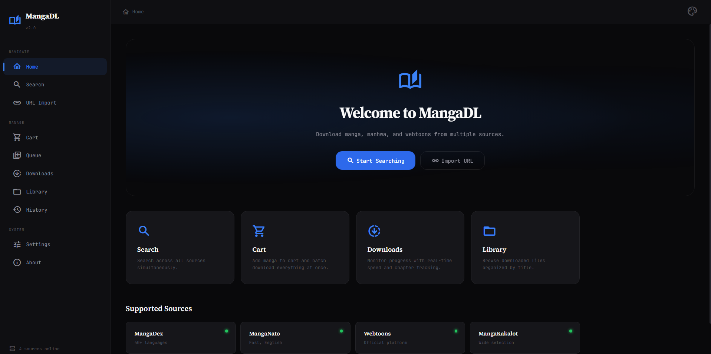
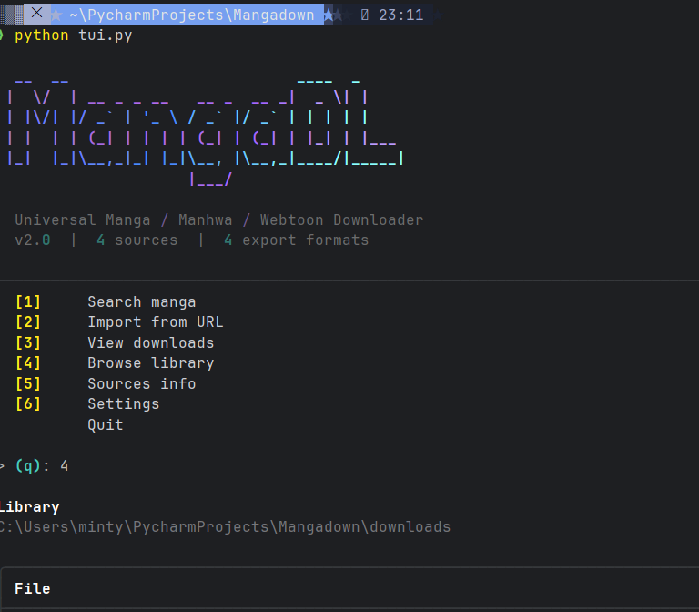
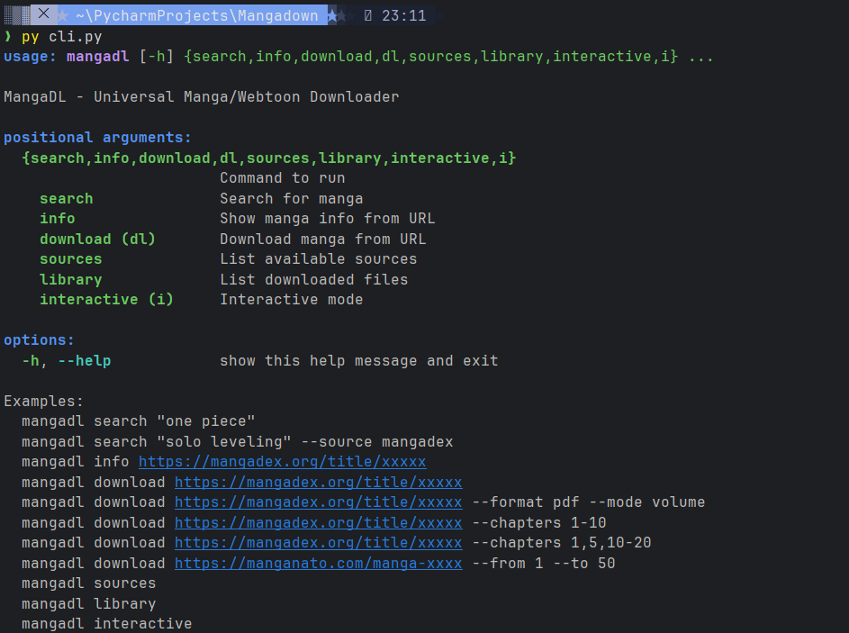

<div align="center">

# MangaDL

### Universal Manga / Manhwa / Webtoon Downloader

A complete, self-hosted desktop and web application for downloading manga from multiple sources with a beautiful UI, multiple export formats, and powerful batch capabilities.

[](https://www.python.org/)
[](https://flask.palletsprojects.com/)
[](LICENSE)
[]()
[]()
[]()

[](https://github.com/Compromisee/MangaDL/stargazers)
[](https://github.com/Compromisee/MangaDL/issues)
[](https://github.com/Compromisee/MangaDL/network)
[](https://github.com/Compromisee/MangaDL/commits)

 [Installation](#installation) • [Usage](#usage) • [Building](BUILD.md) • [Documentation](#file-documentation) • [Troubleshooting](#troubleshooting) • [Features](FEATURES.md)

</div>

---

## Table of Contents

- [About](#about)
- [Features](#features)
- [Supported Sources](#supported-sources)
- [Export Formats](#export-formats)
- [Download Modes](#download-modes)
- [Screenshots](#screenshots)
- [Installation](#installation)
- [Usage](#usage)
  - [Web Interface](#web-interface)
  - [Desktop GUI (Tkinter)](#desktop-gui-tkinter)
  - [Terminal UI (TUI)](#terminal-ui-tui)
  - [Command Line](#command-line)
- [Building Executables](#building-executables)
- [File Documentation](#file-documentation)
- [Configuration](#configuration)
- [Themes & Accessibility](#themes--accessibility)
- [Future Roadmap](#future-roadmap)
- [Troubleshooting](#troubleshooting)
- [Contributing](#contributing)
- [License](#license)
- [Disclaimer](#disclaimer)

---

## About

MangaDL is a universal downloader that fetches manga, manhwa, and webtoons from popular sites and exports them in your preferred format. Unlike browser extensions or one-off scripts, MangaDL gives you four interfaces (web dashboard, desktop GUI, colorful TUI, CLI), multi-threaded downloads, batch cart support, language switching, and 9 themes including high contrast accessibility modes.

Built with **Flask + Socket.IO** on the backend and a **vanilla JavaScript** frontend (no React/Vue bloat), it runs entirely on your machine — no servers, no accounts, no telemetry.

---

## Features

<details>
<summary><b>Click to show simple features list</b></summary>

### Core
- Search across **4 sources** simultaneously with multi-threaded queries
- **URL import** — paste any supported URL to fetch manga info
- **Multi-language** support (40+ languages on MangaDex)
- **Live language switching** — reload chapters in another language without losing your place
- **Volume detection** — chapters auto-grouped by volume

### Downloads
- **4 export formats**: CBZ, PDF, EPUB (fixed-layout), Images
- **3 download modes**: by chapter, by volume, all-in-one
- **Multi-threaded** image downloads (configurable 2-16 workers)
- **Resume-friendly** — failed pages auto-retry with exponential backoff
- **Real-time progress** via WebSocket — speed, percentage, current chapter
- **Cancel any download** mid-flight

### Batch & Queue
- **Cart system** — add multiple manga, configure each, download all at once
- **Queue view** — see what's waiting
- **Concurrent task limit** — control how many manga download in parallel

### UI / UX
- **9 themes**: Dark, Light, Midnight, Forest, Rose, Amber, Ocean, HC Dark, HC Light
- **Confetti animation** when downloads complete
- **Splash screen** with animated loader
- **Dashboard** with stats, source status, format cards
- **History** of recently viewed manga (saved locally)
- **Library browser** to see what you've downloaded
- **Search filters** — chapter range, volume range, select all/none/invert
- **Accessibility**: reduced motion, larger text, WCAG AAA high contrast modes
- **Keyboard navigation** throughout

### Developer
- **Modular source system** — add new sites by extending `BaseSource`
- **Pluggable exporters** — add new formats by implementing the exporter interface
- **REST API** — every action exposed via HTTP endpoints
- **WebSocket events** — real-time updates pushed to clients

</details>

---

## Supported Sources

| Source | Domain | Languages | Notes |
|--------|--------|-----------|-------|
| **MangaDex** | mangadex.org | 40+ | Largest catalog, official API |
| **MangaNato** | manganato.com | English | Fast, mostly translated manga |
| **Webtoons** | webtoons.com | Multi | Official LINE Webtoons platform |
| **MangaKakalot** | mangakakalot.com | English | Wide selection |

---

## Export Formats

| Format | Use Case | Best For |
|--------|----------|----------|
| **CBZ** | Comic readers | YACReader, CDisplayEx, Komga |
| **PDF** | Universal viewing | Any device with a PDF reader |
| **EPUB** | E-readers | Apple Books, Kindle (sideload), Kobo |
| **Images** | Maximum flexibility | Custom workflows, archival |

---

## Download Modes

| Mode | Description | Output |
|------|-------------|--------|
| **By chapter** | Each chapter saved as a separate file | `Chapter 1.cbz`, `Chapter 2.cbz`, ... |
| **By volume** | Chapters grouped into volumes | `Volume 1.cbz`, `Volume 2.cbz`, ... |
| **All-in-one** | Entire selection in one file | `Series Complete.cbz` |

---

## Screenshots

> Add your screenshots here in a `screenshots/` folder and reference them:

```



```

---

## Installation

### Requirements

- **Python 3.10** or newer
- **pip** (Python package manager)
- ~200 MB free disk space (dependencies)

### Quick Install

<details open>
<summary><b>Windows</b></summary>

```batch
:: Clone repository
git clone https://github.com/Compromisee/MangaDL.git
cd mangadl

:: Create virtual environment
python -m venv venv
venv\Scripts\activate

:: Install dependencies
pip install -r requirements.txt

:: Run the web interface
python app.py
```

Open **http://localhost:5000** in your browser.

</details>

<details>
<summary><b>macOS</b></summary>

```bash
# Install Python 3.10+ if needed
brew install python@3.11

# Clone repository
git clone https://github.com/Compromisee/MangaDL.git
cd mangadl

# Create virtual environment
python3 -m venv venv
source venv/bin/activate

# Install dependencies
pip install -r requirements.txt

# Run the web interface
python app.py
```

</details>

<details>
<summary><b>Linux</b></summary>

```bash
# Install system dependencies (Debian/Ubuntu)
sudo apt update
sudo apt install python3 python3-venv python3-pip python3-dev libxml2-dev libxslt1-dev

# Clone repository
git clone https://github.com/Compromisee/MangaDL.git
cd mangadl

# Create virtual environment
python3 -m venv venv
source venv/bin/activate

# Install dependencies
pip install -r requirements.txt

# Run the web interface
python app.py
```

</details>

---

## Usage

MangaDL provides **four interfaces** — pick the one you like:

### Web Interface

The full-featured dashboard with all features.

```bash
python app.py
```

Open **http://localhost:5000**.

**Features available:**
- Search, URL import, manga modal, cart, queue, library, history, themes, settings, downloads with live progress

### Desktop GUI (Tkinter)

A native desktop window — no browser needed.

```bash
python gui.py
```

**Features available:**
- Sidebar nav, manga browser, chapter/volume selection, downloads, settings

### Terminal UI (TUI)

Beautiful colorful terminal interface with gradient progress bars.

```bash
pip install rich  # one-time
python tui.py
```

**Features available:**
- Menus, search, manga detail, chapter selection, live progress with gradient bars

### Command Line

Scriptable, automation-friendly.

<details>
<summary><b>CLI examples</b></summary>

```bash
# Search across all sources
python cli.py search "one piece"

# Search specific source
python cli.py search "solo leveling" --source mangadex

# Show manga info
python cli.py info https://mangadex.org/title/xxxxx

# Download all chapters as CBZ
python cli.py download https://mangadex.org/title/xxxxx

# Download with options
python cli.py download https://mangadex.org/title/xxxxx \
    --format pdf \
    --mode volume \
    --from 1 --to 10

# Custom chapter list
python cli.py download https://mangadex.org/title/xxxxx \
    --chapters "1,3,5-15,20"

# Custom output directory
python cli.py download https://mangadex.org/title/xxxxx \
    --output /path/to/manga

# Skip confirmation
python cli.py download https://mangadex.org/title/xxxxx -y

# Interactive guided mode
python cli.py interactive

# List available sources
python cli.py sources

# Show downloaded files
python cli.py library
```

</details>

---

## Building Executables

For creating standalone `.exe` / `.app` / Linux binaries — see [**BUILD.md**](BUILD.md) for the full build guide.

Quick command:

```bash
python build.py           # Web GUI version
python build.py --cli     # CLI version
python build.py --both    # Both
```

---

## File Documentation

<details>
<summary><b>Project structure overview</b></summary>

```
mangadl/
├── app.py                  # Flask web server + REST API + Socket.IO
├── gui.py                  # Tkinter desktop GUI
├── tui.py                  # Rich terminal UI
├── cli.py                  # Command-line interface
├── config.py               # Global configuration
├── build.py                # PyInstaller EXE builder
├── requirements.txt        # Python dependencies
│
├── sources/                # Manga source adapters
│   ├── __init__.py         # Source registry & URL detection
│   ├── base.py             # Abstract BaseSource class
│   ├── mangadex.py         # MangaDex API implementation
│   ├── manganato.py        # MangaNato HTML scraper
│   ├── webtoons.py         # Webtoons.com scraper
│   └── mangakakalot.py     # MangaKakalot scraper
│
├── exporters/              # Output format handlers
│   ├── __init__.py         # Exporter registry
│   ├── cbz.py              # CBZ archive writer
│   ├── pdf.py              # PDF generator
│   ├── epub.py             # Fixed-layout EPUB builder
│   └── images.py           # Raw image folder exporter
│
├── downloader/             # Download engine
│   ├── __init__.py
│   └── engine.py           # Multi-threaded task manager
│
├── templates/
│   └── index.html          # Web dashboard
│
├── static/
│   ├── css/style.css       # Theme system + dashboard styles
│   ├── js/app.js           # Frontend logic
│   └── favicon.svg         # SVG favicon
│
├── downloads/              # Default output directory
└── temp/                   # Temporary download buffer
```

</details>

### Core Files

<details>
<summary><b><code>app.py</code> — Flask web server</b></summary>

**Purpose:** Hosts the web dashboard and exposes the REST API.

**Endpoints:**
- `GET /` — serves the dashboard
- `POST /api/search` — multi-source search
- `POST /api/manga_info` — fetch chapters for a manga (with language)
- `POST /api/languages` — list available languages
- `POST /api/download` — start a new download task
- `GET /api/tasks` — list all download tasks
- `POST /api/cancel/<task_id>` — cancel a running task
- `POST /api/clear_completed` — remove finished tasks from list
- `GET /api/library` — list downloaded files
- `POST /api/open_folder` — open download folder in OS file manager
- `GET /api/settings` — get current config
- `POST /api/settings` — update config (threads, timeout, dir, etc.)

**Socket.IO events:**
- `download_progress` — emitted when a task updates (status, %, speed)

</details>

<details>
<summary><b><code>gui.py</code> — Tkinter desktop GUI</b></summary>

**Purpose:** Standalone desktop window using Python's built-in Tkinter — no browser required.

**Components:**
- `MangaDLApp` — main window class
- Sidebar navigation (Search, URL, Downloads, Settings)
- Treeview-based result lists
- Chapter selection with checkbox column
- Live download polling (1Hz)

</details>

<details>
<summary><b><code>tui.py</code> — Terminal UI</b></summary>

**Purpose:** Colorful interactive terminal interface using the `rich` library.

**Features:**
- Gradient ASCII banner
- Menu-based navigation
- Color-coded sources
- Live download progress with gradient bars
- Tree view for volumes
- Paginated chapter lists

</details>

<details>
<summary><b><code>cli.py</code> — Command-line interface</b></summary>

**Purpose:** Scriptable automation-friendly CLI built with `argparse`.

**Subcommands:**
- `search` — search for manga
- `info` — display manga details
- `download` (alias: `dl`) — download chapters
- `sources` — list available sources
- `library` — list downloaded files
- `interactive` (alias: `i`) — guided mode

</details>

<details>
<summary><b><code>config.py</code> — Global configuration</b></summary>

**Variables:**
- `BASE_DIR` — project root path
- `DOWNLOAD_DIR` — where files are saved
- `TEMP_DIR` — temp scratch space
- `MAX_WORKERS` — concurrent page downloads (default: 8)
- `MAX_CONCURRENT_TASKS` — max simultaneous manga downloads (default: 3)
- `CHUNK_SIZE` — bytes per HTTP read (default: 8192)
- `REQUEST_TIMEOUT` — HTTP timeout in seconds (default: 30)
- `RETRY_ATTEMPTS` — retries on failure (default: 3)
- `RETRY_DELAY` — seconds between retries (default: 2)
- `USER_AGENT` — browser identification string
- `HEADERS` — default HTTP headers

</details>

### Source Adapters

<details>
<summary><b><code>sources/base.py</code> — Abstract base class</b></summary>

**Defines:**
- `Chapter` dataclass — id, number, title, url, volume, language, pages, page_count
- `MangaInfo` dataclass — full manga metadata + chapter list
- `BaseSource` abstract class with required methods:
  - `search(query)` → `list[MangaInfo]`
  - `get_manga_info(url, language)` → `MangaInfo`
  - `get_chapter_pages(chapter)` → `list[str]` (image URLs)
  - `get_languages(url)` → `list[str]` (optional)

Includes shared HTTP helpers using `cloudscraper` for Cloudflare bypass.

</details>

<details>
<summary><b><code>sources/mangadex.py</code></b></summary>

Uses MangaDex's official REST API. Handles:
- Pagination (500 chapters per request)
- Multi-language filtering
- Volume metadata
- Cover art resolution
- AT-Home server image URLs
- External chapter filtering
- Deduplication by `(chapter_number, volume)` key

</details>

<details>
<summary><b><code>sources/manganato.py</code></b></summary>

HTML scraper for manganato.com. Parses:
- Search results page
- Manga info page (title, author, status, genres, description)
- Chapter list with extraction of chapter numbers
- Image URLs from reader pages with proper Referer header

</details>

<details>
<summary><b><code>sources/webtoons.py</code></b></summary>

Scraper for webtoons.com. Handles:
- Search across language subdomains
- Episode list pagination
- Image lazy-loading via `data-url` attribute
- Language code switching in URLs

</details>

<details>
<summary><b><code>sources/mangakakalot.py</code></b></summary>

Scraper for mangakakalot.com. Similar to manganato but with different DOM structure.

</details>

### Exporters

<details>
<summary><b><code>exporters/cbz.py</code></b></summary>

Creates Comic Book ZIP archives. Single-mode and volume-mode supported. Uses `ZIP_STORED` (no compression) for faster reading by comic apps.

</details>

<details>
<summary><b><code>exporters/pdf.py</code></b></summary>

Uses Pillow's PDF saving to combine images into a multi-page PDF. Handles RGB conversion automatically.

</details>

<details>
<summary><b><code>exporters/epub.py</code></b></summary>

**Custom-built fixed-layout EPUB writer** — does not use `ebooklib`. Constructs the EPUB zip manually for full control over:
- `mimetype` file (must be first, uncompressed)
- `META-INF/container.xml`
- `OEBPS/content.opf` with `rendition:layout: pre-paginated`
- Per-page XHTML with viewport meta matching image dimensions
- Auto-converts WebP/PNG-with-alpha to JPEG for compatibility
- Validates correctly in Apple Books, Calibre, Kobo

</details>

<details>
<summary><b><code>exporters/images.py</code></b></summary>

Copies raw image files into organized folders. No conversion or compression.

</details>

### Engine

<details>
<summary><b><code>downloader/engine.py</code></b></summary>

**`DownloadEngine`** class — manages all download tasks.

**`DownloadTask`** dataclass — tracks one manga download:
- task_id, manga, chapters, format, mode
- status (queued, running, completed, error, cancelled)
- progress %, speed, downloaded bytes
- current_chapter, completed_chapters, errors
- cancel_flag for graceful abortion

**Threading model:**
- Outer `ThreadPoolExecutor` for tasks (4 workers)
- Inner `ThreadPoolExecutor` per chapter for pages (configurable)
- Per-chapter retry with exponential backoff
- Lock-protected speed/byte counters

</details>

### Frontend

<details>
<summary><b><code>templates/index.html</code></b></summary>

Single-page dashboard with all views as `<section class="view">` blocks. Uses semantic HTML, Material Icons Outlined, and JetBrains Mono / Source Serif 4 fonts.

</details>

<details>
<summary><b><code>static/css/style.css</code></b></summary>

**Theme system** with 9 themes via `[data-theme="..."]` selectors and CSS custom properties. Includes:
- Splash animation
- Sidebar nav with active indicator
- Card grid layouts with hover effects
- Modal with backdrop blur
- Progress bars with status colors
- Confetti canvas overlay
- Toggle switches for accessibility
- Reduced motion + larger text classes

</details>

<details>
<summary><b><code>static/js/app.js</code></b></summary>

Vanilla JavaScript — no frameworks. Modules:
- Theme manager (9 themes + accessibility prefs in localStorage)
- Confetti particle system
- Splash controller
- Socket.IO client
- Search / URL import
- Modal with chapter & volume tabs
- Cart with localStorage persistence
- Download manager with live updates
- Library / History / Settings views
- Toast notifications

</details>

---

## Configuration

All settings are configurable via the **Settings** view in the dashboard or by editing `config.py`.

| Setting | Default | Range | Description |
|---------|---------|-------|-------------|
| Download threads | 8 | 1-32 | Concurrent page downloads per chapter |
| Default format | cbz | cbz, pdf, epub, images | Export format for new downloads |
| Default mode | chapter | chapter, volume, all | How chapters are organized |
| Download directory | `./downloads` | any path | Where files are saved |
| Request timeout | 30s | 5-300 | HTTP timeout per request |
| Retry attempts | 3 | 1-20 | Failed page retry count |
| Max concurrent tasks | 3 | 1-8 | Simultaneous manga downloads |

Settings are saved live and persist across sessions.

---

## Themes & Accessibility

### Themes

| Theme | Style |
|-------|-------|
| **Dark** (default) | Minimalist dark, blue accent |
| **Light** | Clean bright, blue accent |
| **Midnight** | Pure black OLED, indigo accent |
| **Forest** | Dark green-tinted, green accent |
| **Rose** | Warm pink-tinted, rose accent |
| **Amber** | Sepia warm, amber accent |
| **Ocean** | Deep teal, cyan accent |
| **HC Dark** | High contrast (WCAG AAA), electric cyan |
| **HC Light** | High contrast (WCAG AAA), classic blue |

### Accessibility Features

- **Reduce motion** — disables all animations, respects OS `prefers-reduced-motion`
- **Larger text** — increases base font size globally
- **High contrast modes** with thick borders, bold weights, 3px focus outlines
- **Keyboard navigation** throughout the dashboard
- **Screen reader friendly** semantic HTML

---

## Future Roadmap

<details>
<summary><b>Planned features (community contributions welcome)</b></summary>

### Sources (planned)
- [ ] **Bato.to** — alternative MangaDex mirror
- [ ] **Tachidesk / Suwayomi** plugin compatibility layer
- [ ] **Comick.io** integration
- [ ] **Toonily** for manhwa
- [ ] **Asura Scans** for the latest releases
- [ ] **MangaPlus** (Shueisha official)
- [ ] **NHentai** support (with content warning)
- [ ] **DynastyScans** for yuri/shoujo-ai

### Features
- [ ] **Auto-update checker** — notify when new chapters drop on followed manga
- [ ] **Library scanner** — index existing downloads, mark as "owned"
- [ ] **Reading tracker** — sync with AniList / MyAnimeList
- [ ] **Built-in reader** — view downloaded manga without external app
- [ ] **OCR translation** — translate scanlations on-the-fly using Tesseract
- [ ] **CBR support** (RAR archives) — read-only, requires `unrar`
- [ ] **MOBI export** for Kindle compatibility
- [ ] **Cover-only download** mode for collection databases
- [ ] **Webhook notifications** (Discord, Telegram) when downloads finish
- [ ] **RSS feed** of new chapters from your favorites
- [ ] **Smart resume** — detect partial downloads and continue
- [ ] **Bandwidth limiter** — throttle download speed
- [ ] **Proxy support** — SOCKS5 / HTTP proxy for region-locked content
- [ ] **CAPTCHA solver** integration (anti-bot bypass)
- [ ] **Browser extension** — add manga to MangaDL queue from any site

### UI / UX
- [ ] **Custom theme builder** — pick your own colors
- [ ] **Mobile PWA** — install on phone, push notifications
- [ ] **Drag-and-drop** chapter reordering
- [ ] **Keyboard shortcuts** panel
- [ ] **Internationalization (i18n)** — translate UI to other languages
- [ ] **Custom CSS injection** for power users
- [ ] **Compact / spacious density toggle**

### Backend
- [ ] **SQLite database** — replace localStorage history with persistent DB
- [ ] **Multi-user support** — accounts, separate libraries
- [ ] **Public-facing mode** — share library with friends (optional)
- [ ] **Docker image** — one-command deployment
- [ ] **REST API documentation** — OpenAPI/Swagger spec
- [ ] **Plugin system** — load community sources without editing core code
- [ ] **GraphQL endpoint** as an alternative to REST

### Performance
- [ ] **HTTP/2 multiplexing** for faster image fetches
- [ ] **Smart caching** — avoid re-downloading covers / metadata
- [ ] **Image deduplication** — detect duplicate pages across chapters

</details>

---

## Troubleshooting

<details>
<summary><b>Server won't start / Port 5000 in use</b></summary>

**Cause:** Another app is using port 5000 (common on macOS — AirPlay Receiver).

**Fix:** Edit the last line of `app.py`:

```python
socketio.run(app, host="0.0.0.0", port=8080, ...)
```

Or disable AirPlay: System Settings → General → AirDrop & Handoff → AirPlay Receiver → Off.

</details>

<details>
<summary><b>"No module named X" error</b></summary>

**Cause:** Dependencies not installed in your active environment.

**Fix:**
```bash
# Make sure your venv is active
source venv/bin/activate    # Linux/Mac
venv\Scripts\activate       # Windows

# Reinstall everything
pip install --upgrade -r requirements.txt
```

</details>

<details>
<summary><b>MangaDex shows "0 chapters" but the site has chapters</b></summary>

**Causes & fixes:**
1. **Wrong language selected** — switch language in the modal dropdown
2. **All chapters are external** — some titles only link to other readers; nothing MangaDL can download
3. **Adult content** — verify the source code includes `pornographic` content rating in `sources/mangadex.py`

</details>

<details>
<summary><b>EPUB images appear tiny / wrong size</b></summary>

**Cause:** Your EPUB reader doesn't support fixed-layout EPUBs.

**Fix:** Use a reader that supports EPUB 3 fixed-layout:
- ✅ Apple Books (macOS / iOS)
- ✅ Calibre Viewer
- ✅ Kobo readers
- ✅ Thorium Reader (free, cross-platform)
- ❌ Older Kindle apps (no FXL support)

Alternative: export as **CBZ** and use a comic reader like YACReader.

</details>

<details>
<summary><b>EPUB shows "document not found" on iOS</b></summary>

This was a bug in earlier versions. Pull the latest `exporters/epub.py` — the new manual EPUB builder produces validator-clean files that pass Apple Books strict validation.

</details>

<details>
<summary><b>Downloads stuck / very slow</b></summary>

**Try:**
1. Lower thread count (Settings → Threads → 4)
2. Increase timeout (Settings → Request timeout → 60)
3. Check your internet connection
4. Some sources rate-limit aggressively — try a different source for the same manga
5. Disable VPN if active (some sources block VPN IPs)

</details>

<details>
<summary><b>"403 Forbidden" or "Cloudflare challenge" errors</b></summary>

**Cause:** Source site detected non-browser traffic.

**Fix:** Already handled by `cloudscraper`. If still failing:
```bash
pip install --upgrade cloudscraper
```
If that fails, the site may have updated their protection — please open a GitHub issue.

</details>

<details>
<summary><b>Cover images don't load in search results</b></summary>

**Cause:** Some sources use hot-link protection or slow CDNs.

**Fix:** Covers are lazy-loaded and may take a few seconds. The placeholder icon stays visible until loading completes. If they never load, check the browser console (F12) for CORS or 403 errors.

</details>

<details>
<summary><b>Built EXE fails / Antivirus flags it</b></summary>

**Cause:** PyInstaller bundles trigger heuristic antivirus detection (false positive).

**Fixes:**
1. Add the `dist/` folder to your antivirus exclusion list
2. Build with the `--noconsole` flag removed (so you can see error output)
3. Sign your EXE with a code-signing certificate (production deployments)
4. Submit the EXE to your antivirus vendor as a false positive

See [BUILD.md](BUILD.md) for more details.

</details>

<details>
<summary><b>"Permission denied" when saving files</b></summary>

**Cause:** Download directory is read-only or owned by another user.

**Fix:** Settings → Download directory → choose a writable folder (e.g., `~/Downloads/manga`).

</details>

<details>
<summary><b>Confetti / animations make my browser lag</b></summary>

**Fix:** Settings → Reduce motion → ON. This disables all animations including confetti.

</details>

<details>
<summary><b>"WebSocket connection failed" in console</b></summary>

**Cause:** Reverse proxy or firewall blocking WebSocket upgrade.

**Fix:** If using nginx in front of MangaDL, add:
```nginx
location /socket.io/ {
    proxy_pass http://127.0.0.1:5000/socket.io/;
    proxy_http_version 1.1;
    proxy_set_header Upgrade $http_upgrade;
    proxy_set_header Connection "upgrade";
}
```

</details>

<details>
<summary><b>Can't find downloaded files</b></summary>

By default, files go to `./downloads/` in the project folder. Check the actual path in **Settings → Download directory**, then click **Library → Open folder** to open it in your file manager.

</details>

---

## Contributing

Contributions welcome. To add a new source:

1. Create `sources/yoursite.py` extending `BaseSource`
2. Implement `search()`, `get_manga_info()`, `get_chapter_pages()`
3. Register it in `sources/__init__.py`:
   ```python
   from sources.yoursite import YourSiteSource
   SOURCES = {..., "yoursite": YourSiteSource}
   SOURCE_PATTERNS = {..., "yoursite.com": "yoursite"}
   ```
4. Test with `python cli.py search "test" --source yoursite`
5. Submit a PR

---

## License

MIT License — see [LICENSE](LICENSE) for details.

```
Copyright (c) 2024 MangaDL Contributors

Permission is hereby granted, free of charge, to any person obtaining a copy
of this software and associated documentation files (the "Software"), to deal
in the Software without restriction...
```

---

## Disclaimer

MangaDL is a **personal-use tool** for downloading content you have legal access to. Users are responsible for:

- Respecting each site's **Terms of Service** and `robots.txt`
- **Supporting creators** by purchasing official manga when available
- Complying with **local copyright laws**
- Not using this tool for **commercial redistribution**

The developers are not responsible for misuse of this software. When in doubt, **buy the manga**.

---

<div align="center">

**Made with care by the MangaDL contributors**

If you find this project useful, please consider giving it a star

[](https://github.com/Compromisee/MangaDL)

</div>

---
